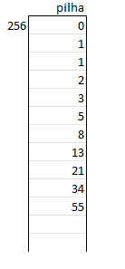
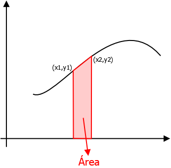
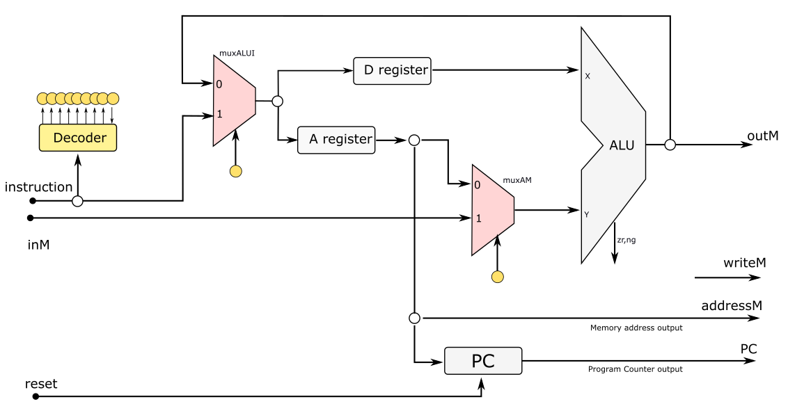

# Av4 - 2° Semestre de 2021


Avaliação 4 - Elementos de Sistemas

| Pontos SW      |
| :--:           |
|  70            |

- Avaliação **individual**.
- **120 min** total.
- Ficar conectado no canal geral no Teams (para ouvir instruções).
- Ficar no blackboard durante a prova.
- Clonar o seu repositório (e trabalhar nele)
- Fazer **commit** ao final de cada questão.
- Lembre de dar **push** ao final.


**LEMBRE DE REALIZAR UM COMMIT (A CADA QUESTÃO) E DAR PUSH AO FINALIZAR**


## 1. Sequência de Fibonacci

| Pontos SW      |
| :--:           |
|  15            |

A sequência de Fibonacci é uma sequência de números inteiros, onde cada termo subsequente corresponde à soma dos dois termos anteriores. A sequência normalmente começa com "0" e "1" e tem aplicações em diversas áreas como mercado financeiro, ciências da computação e fenômenos da natureza.

Neste caso, solicita-se que seja escrito um programa usando a linguagem de máquina virtual de pilha para escrever os 11 primeiros números da sequência de Fibonacci na pilha.


#### Resultado:




### Implementação

Implemente a programação no arquivo `vm/fibonacci/Main.vm`

### Testes

Editar o arquivo `tests/testsVM/config_testes.txt` selecionando o que desejam testar.

Execute o script

```
./testeVm.py
```


#### Rubrica para avaliação:

| Pontos SW    | Descritivo     |
| :--------    | :--            |
|   15         |  Sequência criada com uso de **loop**   |
|   5          |  Sequência criada sem uso de **loop**   |


## 2. Integração numérica

| Pontos SW      |
| :--:           |
|  15            |


"Em matemática, em especial na análise numérica, existe uma grande família de algoritmos, cujo principal objetivo é aproximar o valor de uma dada integral definida de uma função sem o uso de uma expressão analítica para a sua primitiva. Normalmente, estes métodos adotam as seguintes três fases: decomposição do domínio em pedaços; integração aproximada da função de cada pedaço e soma dos resultados numéricos obtidos." [`Fonte: https://pt.wikipedia.org/wiki/Integração_numérica`](https://pt.wikipedia.org/wiki/Integração_numérica)
    
Deseja-se criar uma função (`trapz`) usando a linguagem de máquina virtual de pilha para calcular a área de um trapézio, que pode ser utilizada para calcular a integral numérica de uma curva.


#### Exemplo:

A área indicada na figura pode ser calculada por: A = (x2-x1)(y1+y2)/2.




### Implementação

Implemente a programação usando a linguagem de máquina virtual de pilha  no arquivo `vm/trapz/trapz.vm`. A ordem dos argumentos passados para a função é x1, y1, x2 e y2. Não alterar o arquivo `vm/trapz/Main.vm`.

> Obs: todos os números (inclusive a área calculada) são inteiros.

> Dica: Podem utilizar as funções div e mult do Projeto H-VM.


### Testes

Editar o arquivo `tests/testsVM/config_testes.txt` selecionando o que desejam testar.

Execute o script

```
./testeVm.py
```

#### Rubrica para avaliação:

| Pontos SW    | Descritivo     |
| :--------    | :--            |
|   15         |  Função implementada e passando nos testes  |
|    ?         |  Implementações incompletas ou incorretas serão analisadas caso a caso   |


## 3. Assembler - instrução modificada

| Pontos SW      |
| :--:           |
|  20            |


Na Av3, foi proposta um modificação na CPU de forma a alterar a posição do MuxALUI permitindo que um valor seja carregado tanto no registrador %A como no %D ou em ambos em um mesmo ciclo. A figura a seguir ilustra a modificação que tinha sido proposta:



O formato das instruções permanece usando 18 bits, mas os dois bits mais significativos (bits 17 e 16) passam a indicar o tipo de instrução da seguinte forma:

- "00" - carregamento no registrador %A (leaw %A)
- "01" - carregamento no registrador %D (leaw %D)
- "10" - instrução tipo C (demais operações)
- "11" - carregamento em ambos os registradores %A e %D. (leaw %A, %D)

No projeto Assembler fornecido, implemente **apenas** a codificação dos destinos (2 bits mais significativos) das instruções tipo A.

#### Exemplo:

leaw $1, %A;     => "000000000000000001"

leaw $2, %D;     => "010000000000000010"

leaw $3, %A, %D;     => "110000000000000011"


### Implementação

Implemente apenas o **dest_load()** no arquivo **Code.java**.

### Testes

O teste deve ser executado dentro do IntelliJ através do arquivo **CodeTest.java**.


#### Rubrica para avaliação:

| Pontos SW    | Descritivo     |
| :--------    | :--            |
|   20         |  Função implementada e passando nos testes  |
|   10         |  Carregamento no registradores individuais funcionando, mas carregamento em ambos os registradores sem passar nos testes   |


## 4. VMTranslator - popp

| Pontos SW      |
| :--:           |
|  20            |


Como sabemos, quando a função pop é executada na máquina virtual de pilha, o último valor da pilha é copiado para o segmento passado como argumento e "apagado" da pilha.

Mas, em algumas situações, pode ser interessante manter o valor na pilha após um comando pop. Assim, queremos incluir na nossa linguagem da máquina virtual o comando `popp` que copia o último valor da pilha mas não o "apaga".


### Implementação

Implemente a tradução do popp no arquivo Code.java no projeto VMTranslator localizado em `VMTranslator/src/main/java/vmtraslator`. Implemente **apenas** a seção temp!!

### Testes

Execute o script

```
./testeVMtranslator.py
```

#### Rubrica para avaliação:

| Pontos SW    | Descritivo     |
| :--------    | :--            |
|   20         |  Função implementada e passando nos testes  |
|    ?         |  Implementações incompletas ou incorretas serão analisadas caso a caso   |
